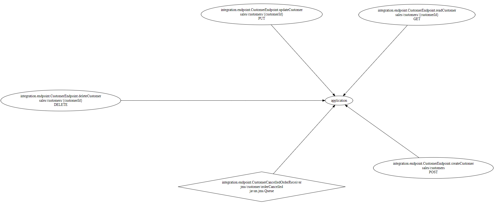

[](https://github.com/Hapag-Lloyd/dist-comm-vis/actions)

# Distributed Communication Visualization

This tool analyzes JAR files and creates a diagram to show
- published endpoints
- outgoing HTTP(S) calls
- event receivers and senders

It also creates a high level diagram of multi project communication, e.g. service 1 calls service 2.

Especially useful to visualize the communication between several services. This documentation is always
up-to-date as it is generated automatically based on the current version of the software.

# Example
```shell
release="1.11.1"
curl -o analyzer.jar https://github.com/Hapag-Lloyd/dist-comm-vis/releases/download/${RELEASE}/analyzer-${RELEASE}.jar
 
java -cp "analyzer.jar;target/test-classes" org.springframework.boot.loader.JarLauncher --name=my-service-1 1234 integration

yum install graphviz
dot -Tpng model.dot > model.png
```


## Features
- extract JAX RS consumers
- extract JMS consumers
- write a `model.json` file
- write a `model.dot` file for [GraphViz](https://gitlab.com/graphviz/graphviz)
- support user defined scanners (see https://github.com/Hapag-Lloyd/dist-comm-vis-api)
- 
## Planned Features
- extract endpoints from Swagger YAML
- extract Kafka consumers and producers
- extract JMS producers
- extract SNS producers
- extract SQS consumers and producers
